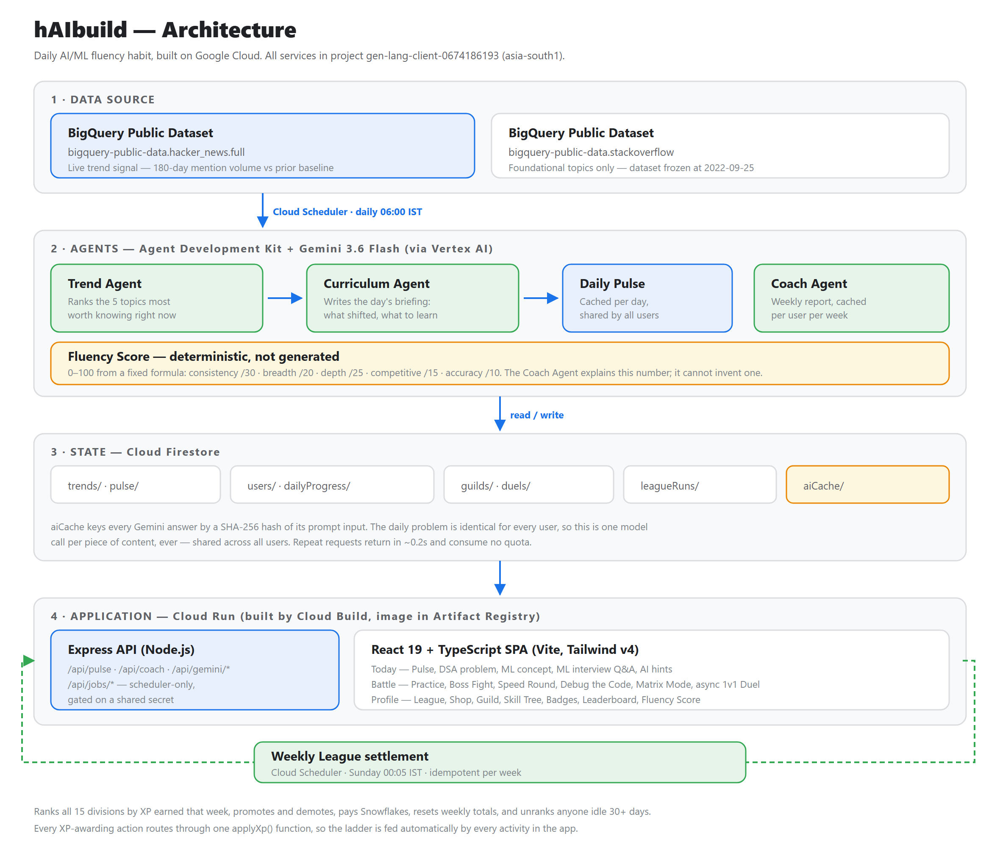

# hAIbuild — Build Your AI/ML Habit, Daily

A gamified daily-habit app that keeps everyone fluent in AI/ML using real industry trend data, in an
engaging way that lets you skip the daily doomscrolling.

**Live app — [haibuild-673509007608.asia-south1.run.app](https://haibuild-673509007608.asia-south1.run.app)**
No signup, no install. A profile is created on first visit.

Built for Patchamomma 2026 on Google Cloud.

---

## Why

AI/ML best practice turns over every few months. The two ways to keep up both fail: scrolling AI news
is passive and leaves nothing behind, and a formal course is heavyweight, already out of date, and
usually abandoned within a fortnight.

hAIbuild makes it a ten-minute daily habit, then engineers hard against the thing that actually kills
learning habits — quitting in week three.

## What it does

Each day the app serves four bite-sized pieces:

| Piece | What it is |
| --- | --- |
| **Pulse** | A briefing on what's genuinely trending, generated each morning by Gemini agents from developer signal *measured* in BigQuery — not editorial guesswork |
| **Concept** | A deep-dive building durable intuition on one core ML idea |
| **Practice** | An applied problem, with an on-demand Gemini hint that guides without solving |
| **Battle** | A timed question that locks the day's learning in and moves an ELO rating |

Everything else exists to make the habit survive a bad week:

- **Weekly League** — 15 divisions across 5 tiers, ranked by XP earned *that week*, settled
  automatically every Sunday at 00:00 IST. Top band skips two divisions, next band climbs one, bottom
  band drops one. Promotion pays Snowflakes.
- **Streaks** with purchasable freezes that cover a missed day automatically
- **Snowflake economy** — earned from league promotions and badges, spent on freezes and XP boosters
- **Six game modes** — Practice Battle, Boss Fight, Speed Round, Debug the Code, Matrix Mode, and
  asynchronous 1v1 Duels over a shareable link
- **Guilds**, a skill tree, 8 badges, and an evolving penguin mascot
- **Weekly Coach report** explaining a 0–100 Fluency Score

## Architecture



### Google Cloud services

| Service | Role |
| --- | --- |
| **BigQuery** | `hacker_news.full` supplies the live trend signal — 180-day mention volume against a prior baseline. `stackoverflow` supplies foundational topic weight only; that dataset ends 2022-09-25, so it is deliberately not used for recency. |
| **Vertex AI** | All Gemini 3.6 Flash calls. Chosen over an API key so the service authenticates as its runtime service account — no key is stored, shipped, or rotated anywhere. |
| **Agent Development Kit** | Three `LlmAgent`s with Zod output schemas: Trend, Curriculum, Coach |
| **Firestore** | All state — trends, daily Pulse, profiles, progress, guilds, duels, league settlements, AI cache |
| **Cloud Run** | One service hosting both the Express API and the React front-end |
| **Cloud Build + Artifact Registry** | Source-based deploys via Buildpacks, no Dockerfile |
| **Cloud Scheduler** | Two jobs: daily trend refresh (06:00 IST), weekly league settlement (Sunday 00:05 IST) |
| **Firebase** | Client Firestore SDK and security rules; Admin SDK server-side |

### Notes on a few decisions

**One model call per piece of content, ever.** The daily problem is identical for every user, so
generated hints and elaborations are cached in Firestore under a SHA-256 hash of the prompt input and
shared across all users. Repeat requests return in ~0.2s and consume no quota. The Pulse is cached per
day; the Coach report per user per week.

**The Fluency Score is arithmetic, not generation.** A fixed formula over real activity — consistency
/30, breadth /20, depth /25, competitive /15, accuracy /10. The Coach Agent is constrained to *explain*
that number, never to produce its own, because a model asked to score someone returns a figure that
drifts between runs and can't be audited.

**Ladder bands are a sixth of a division, not a third.** A third looks reasonable per band but adds up
to two-thirds of every division promoted and the rest demoted with nobody holding — the whole
population reaches the top tier within two months and the ladder stops meaning anything.

**One entry point for XP.** Every action that awards XP routes through a single function that applies
booster charges, updates the level, and credits the league week — so the ladder is fed automatically
by every activity, and anything added later joins it without further wiring.

**The league week is anchored to Sunday 00:00 IST.** The generic 7-day bucket used elsewhere is
epoch-anchored, and the epoch fell on a Thursday, so it can't express a Sunday boundary.

## Running locally

**Prerequisites:** Node.js 20+, and a Google Cloud project with Firestore, BigQuery and Vertex AI
enabled.

```bash
npm install
cp .env.example .env.local     # then fill in the values
npm run dev                    # http://localhost:3000
```

`.env.local` needs the Firebase web config, plus **either**:

- **Vertex AI** (recommended) — `GOOGLE_GENAI_USE_ENTERPRISE=true`, `GOOGLE_CLOUD_PROJECT`,
  `GOOGLE_CLOUD_LOCATION=global`, and `GOOGLE_APPLICATION_CREDENTIALS` pointing at a service-account
  key with `roles/aiplatform.user`, `roles/datastore.user` and `roles/bigquery.jobUser`
- **An AI Studio API key** — `GEMINI_API_KEY`. Simpler to set up, but an unbilled project is capped at
  20 requests per day for the whole project.

`GET /api/health` reports which backend is active.

### Scripts

| Command | Does |
| --- | --- |
| `npm run dev` | Express + Vite dev server |
| `npm run build` | Build the client, bundle the server to `dist/` |
| `npm start` | Run the production bundle |
| `npm run lint` | Typecheck |
| `npm run compute-pulse` | Run the BigQuery trend query and republish `trends/pulse` |
| `npm run seed-foundational` | Seed foundational topic weights |

## Deploying

```bash
gcloud run deploy haibuild --source . --region asia-south1 --allow-unauthenticated --timeout 600
```

The two scheduled jobs post to `/api/jobs/refresh-pulse` and `/api/jobs/process-league`. Both mutate
state for every user, so they're gated on a shared secret sent as `X-Scheduler-Secret` and refuse
outright if `SCHEDULER_SECRET` is unset rather than defaulting to open. The league job is idempotent
per week — Cloud Scheduler retries non-2xx responses, and applying promotions twice would corrupt the
ladder.

## Project structure

```
agents/         Server-only: ADK agents, BigQuery refresh, league processor, AI cache
bigquery/       The SQL, runnable as-is in the BigQuery console
docs/           Architecture diagram
scripts/        One-off and scheduled pipeline scripts
src/
  components/   React UI
  constants/    League ladder — shared by client and server so rules can't drift
  data/         Static question banks
  store/        Firestore data layer; all XP flows through applyXp()
server.ts       Express API + static hosting
```

## Status and limitations

Deployed and running unattended. The weekly league settlement completed its first fully automatic run
on 6 September 2026 at 00:05 IST — 34 players ranked, 10 promoted, 150 Snowflakes paid out.

Every feature is verified end-to-end with Playwright driving a real browser against the deployed app,
asserting the console stays clean. The ladder maths is separately checked against a simulated 12-week
season.

**Known limitation:** there is no sign-in. Users are identified by a device-generated ID and the
Firestore rules are correspondingly permissive. No personal data is stored — progress and gamification
state only. Moving to Firebase Anonymous Auth and scoping writes to `request.auth.uid` is the next step
before any real launch.
